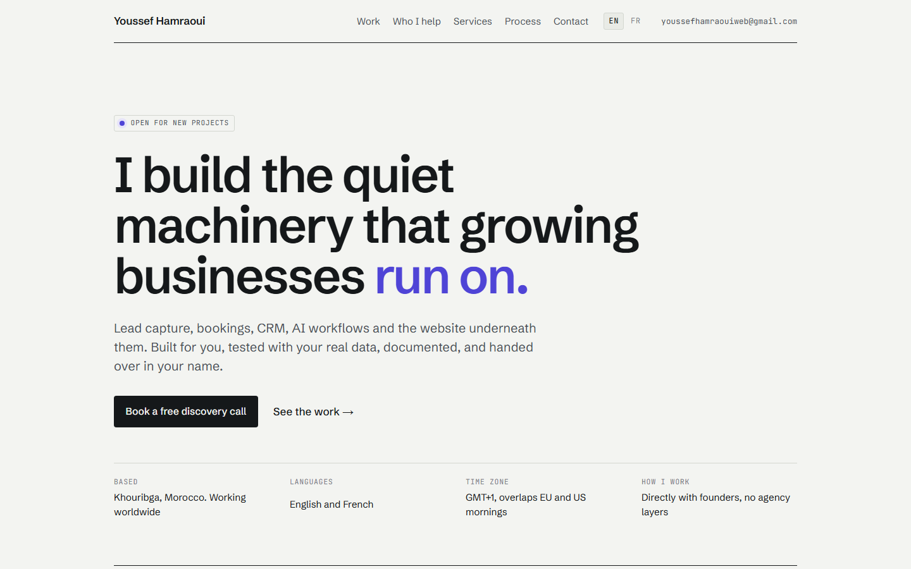

# youssefhamraoui.com

Source of my portfolio and service site. It is live at **[youssefhamraoui.com](https://youssefhamraoui.com)**, in English and French.



I'm Youssef Hamraoui, a full-stack web developer based in Morocco. I build websites, online stores, CRMs and automations for small businesses, and I run my web studio [Skorp](https://skorp.dev).

## What's worth looking at

- **Bilingual routing without a library.** English is served at `/`, French at `/fr`. `proxy.ts` picks the language from a saved cookie, then the browser's `Accept-Language`, then English, and rewrites every page into one `app/[lang]` tree. One page template serves both languages.
- **The build fails if the two languages drift apart.** The English and French copy files share one TypeScript type (`content/types.ts`). A text that exists in one language but not the other is a compile error, not a blank spot in production.
- **Pages generated from content.** Industry pages × Moroccan cities produce the city landing pages, their metadata and their sitemap entries from `content/`. Adding a city is one entry in `content/cities.ts`.
- **A rebuild that kept every old URL.** The site replaced an older version without losing links or search rankings. `scripts/check_site.py` tests a build against all 58 URLs of the previous site, follows every internal link, and checks the language redirects, `sitemap.xml` and `robots.txt` before anything goes live.
- **No runtime dependencies** beyond Next.js and React. Plain CSS, no UI framework, no environment variables.
- **Shipped as a small Docker image.** A multi-stage `Dockerfile` builds a standalone Next.js server that runs as a non-root user. In production it runs on my own Linux server behind Traefik and Cloudflare. A new version is built next to the running one and switched over only after the checks pass, so it can be rolled back in seconds.

**Stack:** Next.js 16 (App Router) · React 19 · TypeScript · CSS · Docker · Python (checks)

---

## Pages

| Page | English URL | French URL |
|------|-------------|------------|
| Home | `/` | `/fr` |
| Case studies | `/work/racha-food`, `/work/galaxy-pets` | `/fr/work/...` |
| Industry pages | `/solutions/restaurants`, `/solutions/e-commerce`, `/solutions/car-rental` | `/fr/solutions/restaurants`, `/fr/solutions/e-commerce`, `/fr/solutions/location-voiture` |
| City pages | `/solutions/<industry>/<city>` | `/fr/solutions/<industry>/<city>` |
| Demos | `/demo/restaurant-system`, `/demo/ecommerce-system` | `/fr/demo/...` |

These are the same URLs as the previous site, so existing links and search results keep working. `sitemap.xml` lists all of them.

## Editing content

| What | Where |
|------|-------|
| Home page copy, menus, footer | `content/dictionaries/en.ts`, `fr.ts` |
| Industry and city page copy | `content/solutions/en.ts`, `fr.ts` |
| City names and local-market paragraphs | `content/cities.ts` |
| Which cities each industry lists | `content/routes.ts` |
| Case studies | `content/cases/en.ts`, `fr.ts` |
| Demos | `content/demos/en.ts`, `fr.ts` |
| Email, socials, project links, images | `content/site.ts` |
| Styles | `app/globals.css` |

English and French files share one type, so the build fails if something exists in one language but not the other. Adding a city means adding it to `content/cities.ts` and to the industry's list in `content/routes.ts`; its pages and sitemap entries are generated.

## Languages

- English is served at the root, French under `/fr`. Internally all pages live in `app/[lang]`, and `proxy.ts` rewrites English URLs to `/en/...`.
- A visitor whose browser prefers French is sent to the French page. A saved choice (`NEXT_LOCALE` cookie) wins over the browser setting.
- The EN switch links to `?lang=en`, which saves the choice and redirects to the clean URL.
- The proxy needs a running Next.js server. A static export (`output: "export"`) would drop it.

## Local development

```bash
npm install
npm run dev
```

## Production build

`next.config.ts` sets `output: "standalone"`, so a build produces a self-contained server in `.next/standalone`.

```bash
npm run build
cp -r public .next/standalone/
cp -r .next/static .next/standalone/.next/
PORT=3000 node .next/standalone/server.js
```

Or with Docker:

```bash
docker build -t youssefhamraoui-site .
docker run -d -p 3000:3000 youssefhamraoui-site
```

## Release steps

1. Build the new version beside the running one.
2. Test it on a temporary address with the check script below.
3. Switch the domain only once every check passes.
4. Keep the previous version so it can be switched back in seconds.

## Checking a build

`scripts/check_site.py` compares a running build with every URL of the previous site, stored in `scripts/old-site-urls.json`. It fetches each page, follows every internal link, and tests the language redirects, `sitemap.xml` and `robots.txt`.

```bash
python scripts/check_site.py https://<temporary address>
```

It ends with `RESULT: all checks passed` and exits with code 0 when everything is fine.

---

© Youssef Hamraoui. All rights reserved. The code is public so it can be read as part of my portfolio; it is not licensed for reuse. Contact: [youssefhamraouiweb@gmail.com](mailto:youssefhamraouiweb@gmail.com)
